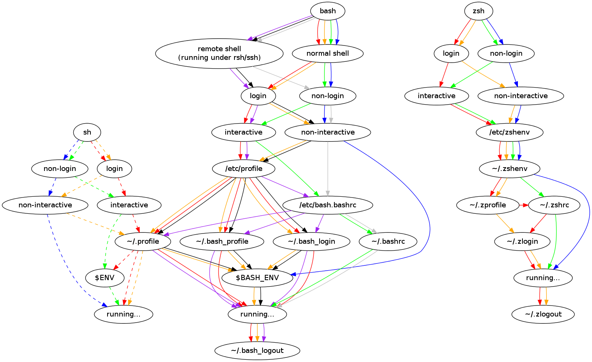

## Workspace Setup

An archive that documents and scripts all aspects of setting up a personal workspace. Due to my
forgetfulness and frequent OS re-installs, I've chosen to take note of it.

---

### Supported Platforms

- Windows (using WSL Ubuntu)
- Linux (Debian, Ubuntu)
- MacOS

---

### Guide

All script things are included in `Makefile`. We need `make` tools in current os that supports for
running make scripts.

#### Linux or WSL Ubuntu (Windows)

- Install `make` tools.
    ```shell
        ./require.linux.sh # Linux or WSL Ubuntu (Windows)
    ```
- Show `$PATH` in a beautiful output.
    ```shell
        make show-path
    ```
- `zsh` and `oh-my-zsh` setup
    ```shell
        make zsh-linux-install
    ```
- Add custom `.zshrc` and `.dircolors` configurations.
    ```shell
        make zsh-linux-custom
    ```
- Show linux packages that are changed from default packages.
    ```shell
        make show-linux-packages
    ```
- Install various essential linux packages.
    ```shell
        make install-essential-linux-packages
    ```
- Push or Pull `.gitconfig` with local file.
    ```shell
        make push-gitconfig
        make pull-gitconfig
    ```

#### MacOS

- Install `make` tools.
    ```shell
        ./require.linux.sh # Linux or WSL Ubuntu (Windows)
    ```
- Show `$PATH` in a beautiful output.
    ```shell
        make show-path
    ```
- `zsh` and `oh-my-zsh` setup
    ```shell
        make zsh-macos-install
    ```
- Add custom `.zshrc` and `.dircolors` configurations.
    ```shell
        make zsh-macos-custom
    ```
- Show Linux packages that are changed from default packages.
    ```shell
        make show-macos-packages
    ```
- Install various essential linux packages.
    ```shell
        make install-essential-macos-packages
    ```
- Push or Pull `.gitconfig` with local file.
    ```shell
        make push-gitconfig
        make pull-gitconfig
    ```

#### Uncompleted yet & TODO

- Push or Pull `vscode` configuration with local file.
    ```shell
        make push-vscode-config
        make pull-vscode-config
    ```
- Auto HotKey for opening Window Terminal (can be used to open WSL by default) in Windows OS.
- TODO
    - [ ] Set up containerization (podman, docker, kubernetes, etc.)
    - [ ] Set up hardware (keyboard, mouse, etc.)
    - [ ] Set up networking
    - [ ] Set up operating systems
    - [ ] Set up programming languages (jdk, sdk, related tools, etc.)

---

### Terminal Loading Process

- In this guide, we're using Zsh shell. So, following this image,
  we'll understand how shell configurations are loaded.



---